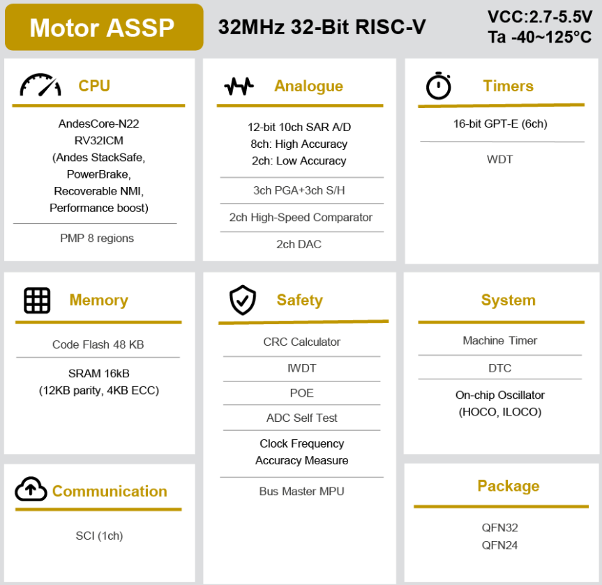

# [R9A02G020](https://doc.soc.xin/R9A02G020)

* [Renesas](https://www.renesas.cn/): [RISC-V](https://github.com/SoCXin/RISC-V)
* [L1R2](https://github.com/SoCXin/Level): 32 MHz

## [简介](https://github.com/SoCXin/R9A02G020/wiki)

[R9A02G020](https://www.renesas.cn/cn/zh/products/microcontrollers-microprocessors/risc-v/r9a02g020-assp-easy-mcu-motor-control-based-risc-v) 基于 RISC-V 的 ASSP EASY 组，产品目标为电机控制应用。 硬件规格的设计的目的是，在无传感器模式或外部传感器输入下的单分流或三分流配置中，有效处理无刷直流电机。

### 关键参数

* 32 MHz Andes N22
* 16KB SRAM (4KB 带ECC) + 48KB Flash
* 1x 12 bit ADC
* 8 bit DAC
* 3ch PGA

## [资源收录](https://github.com/SoCXin)

* [参考资源](src/)
* [参考文档](docs/)
* [参考工程](project/)

## [选型建议](https://github.com/SoCXin/R9A02G020)

[R9A02G020](https://github.com/SoCXin/R9A02G020) 实现电机控制功能的专用应用软件由IDHs （独立设计公司）预先开发，并在工厂生产时在设备内进行烧写编程。这使得用户能够添加复杂的磁场定向电机控制功能，而无需费力进行功能开发、测试以及验证。 外部主机能够通过简单的串行接口控制 ASSP，从而减轻电机控制功能的负担，同时处理多个应用级别的任务。

最终产品由瑞萨硬件与第三方软件技术结合而成。 IDH 是瑞萨的合作伙伴，在电机控制领域具有丰富的专业知识，并具有成熟的客户支持能力，能够确保完成项目并成功地过渡到大规模生产。 与 IDH 合作推出的强有力的协作解决方案是一项基本价值主张，也是取得成功的关键。

R9A02G020 RISC-V MCU ASSP 硬件针对高级电机控制系统进行了专门优化。 它与生态系统合作伙伴一起提供了完整、可量产的电机控制系统解决方案。 借助 32MHz 性能、48/16KB 闪存/RAM 内存、高级模拟功能，R9A02G020 为电机控制整体解决方案奠定了基础。 可选的小型封装选项以及极高温度支持使得该 ASSP 非常适合环境条件恶劣且空间十分有限时的 PCB 设计。

## [www.SoC.xin](http://www.SoC.Xin)
